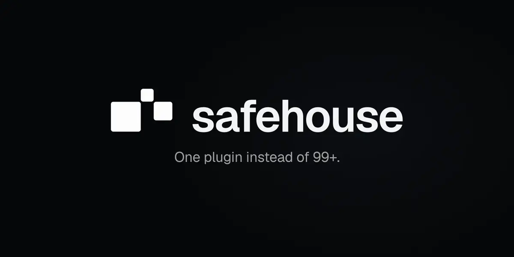

<h1>
  <picture>
    <source media="(prefers-reduced-motion: reduce)" srcset="design/hero/hero-still.webp">
    
  </picture>
</h1>

**One WordPress plugin instead of the single-purpose ones most sites collect over time.** Hardening, bot protection, login limits, install lockdown, change and vulnerability alerts, page and object caching, and the everyday tweaks people usually install a separate plugin for.

Each feature is a module with its own switch, and every module is safe in WP-CLI, cron, REST and AJAX requests. SafeHouse works as the only security plugin on a site, next to Wordfence, and in WooCommerce shops.

SafeHouse has no firewall and no malware scanner. Leave those to Wordfence, Cloudflare or your host.

## Modules

| Module | What it does | Default |
|---|---|---|
| Hardening | File editor off, no username discovery, generic login errors, version hidden, XML-RPC off, security headers, no admin role for new accounts | on |
| Change alerts | E-mail when an admin, plugin, theme, mu-plugin or drop-in appears, or `wp-config.php` and key options change | on |
| Plugin health | Flags plugins that are closed, abandoned, not from WordPress.org, left over, or replaceable by SafeHouse | on |
| Vulnerability alerts | Known vulnerabilities in core, plugins and themes, from signed Wordfence Intelligence data (stands down when Wordfence runs) | on |
| Login limits | Address lockouts that grow longer each time; accounts under attack are paused only for new devices | on |
| Omnibus price history | Next to every reduced price, the lowest price from the 30 days before the reduction (EU Omnibus Directive), from a recorded price history | on with WooCommerce |
| Bot protection | Honeypot, plus Cloudflare Turnstile on login, registration, comments and both WooCommerce checkouts (Store API included) | off |
| Install lockdown | Nobody installs plugins or themes or uploads ZIPs; updates still work | off |
| LiteSpeed page cache | Cache headers and purges for LiteSpeed servers, with no files written | off |
| Cloudflare cache | Clears changed pages on Cloudflare after edits | off |
| SMTP mail, Header and footer scripts, Duplicate posts, Maintenance mode, Tweaks | The small things sites usually install separate plugins for | off |

A Redis object cache (signed values, its own keys only) is installed with `wp shouse object-cache enable`.

<details>
<summary><strong>The plugins it replaces</strong></summary>
<br>

Plugin health recognises these plugins and names the SafeHouse module that does their job. The animation above folds the same list.

| SafeHouse module | Instead of |
|---|---|
| SMTP mail | `wp-mail-smtp`, `post-smtp`, `fluent-smtp`, `easy-wp-smtp`, `smtp-mailer`, `wp-smtp` |
| Login limits | `limit-login-attempts-reloaded`, `loginizer`, `login-lockdown`, `limit-login-attempts`, `wp-limit-login-attempts` |
| Bot protection | `simple-cloudflare-turnstile`, `recaptcha-woo`, `advanced-nocaptcha-recaptcha`, `google-captcha`, `honeypot` |
| Duplicate posts and pages | `duplicate-page`, `duplicate-post`, `post-duplicator` |
| Maintenance mode | `wp-maintenance-mode`, `coming-soon`, `maintenance`, `under-construction-page` |
| Header and footer scripts | `insert-headers-and-footers`, `header-and-footer-scripts`, `header-footer-code-manager`, `head-footer-code`, `wp-headers-and-footers`, `tracking-code-manager`, `hotjar`, `microsoft-clarity` |
| Hardening | `disable-xml-rpc`, `disable-xml-rpc-api`, `stop-user-enumeration` |
| Tweaks | `disable-comments`, `disable-search`, `disable-emojis`, `disable-embeds`, `heartbeat-control` |
| Omnibus price history | `omnibus`, `wc-price-history`, `omnibus-by-ilabs`, `omnibus-for-woocommerce`, `product-price-history` |
| Cloudflare cache | `cloudflare` |

</details>

[`plugin/readme.txt`](plugin/readme.txt) is the full user documentation: every module, the wp-config constants, WP-CLI commands and the external services SafeHouse contacts.

## With Wordfence

Wordfence is optional. When it is active, the SafeHouse features it already provides stand down on their own, so the two never do the same job twice:

- Hardening skips what Wordfence has switched on: username discovery blocking, version hiding and, on sites without WooCommerce, login error masking. The settings page marks each skipped field "Handled by Wordfence, skipped here."
- Vulnerability alerts stand down, because Wordfence warns about vulnerable software itself.
- Login limits stand down while Wordfence brute force protection is on.
- The login and registration captcha steps aside when Wordfence Login Security has its reCAPTCHA on.

## Built not to be the way in

A security plugin must not become the weak spot itself:

- **Signed updates.** WordPress installs a SafeHouse update only when its Ed25519 signature and its checksum both match. How releases are built, signed and checked is under [Install](#install).
- **Admin-only actions.** Every request handler checks `current_user_can()` and a nonce, and every settings change goes to the activity log.
- **No files written at runtime.** The Redis object cache drop-in is written only by WP-CLI.
- **No telemetry.** The activity log stays in the site's database and deletes entries after 90 days.
- **Safe mode.** If a change locks you out, upload an empty file named `shouse-safe-mode` to `wp-content` (FTP is enough), add `define( 'SHOUSE_SAFE_MODE', true );` to `wp-config.php`, or run `wp shouse safe-mode on`. Every module stops until you remove the file or the constant, or run `wp shouse safe-mode off`.

## Install

Requirements: WordPress 6.6+ and PHP 8.1+. WooCommerce is optional.

1. Download `shouse-x.y.z.zip` from [Releases](https://github.com/designhouseme/SafeHouse/releases) and upload it in Plugins → Add New → Upload Plugin.
2. Activate it and open **SafeHouse** in the admin menu.

Updates come from the Design House update host, not WordPress.org. Every release is signed with Ed25519, and WordPress installs a package only when the manifest signature and the package checksum both match. Each GitHub release carries the same three files (`shouse-x.y.z.zip`, `manifest.json`, `manifest.json.sig`), so anyone can check a download against the signed checksum. Releases are built and signed by the [Release workflow](.github/workflows/release.yml) from the version tag, only after a maintainer approves the protected `release` environment that holds the key. The build is reproducible: `./dev/release.sh build x.y.z` rebuilds a byte-identical zip from the tag.

Do not run the plugin from a clone of this repository on a live site. A copy inside a git working copy never updates itself.

## Repository layout

```
plugin/     the plugin as it ships: shouse.php, src/, assets/, languages/, readme.txt, uninstall.php
site/       the landing page (static files on Cloudflare Workers)
updates/    the update host: a read-only Cloudflare Worker serving release files and vulnerability data from R2,
            and updates/ingest/, the token-protected Worker that accepts only new vulnerability data
dev/        Docker environments, test scripts and release tooling
design/     the README animation: an HTML composition rendered to WebP (design/hero/README.md)
CHANGELOG.md, composer.json, phpcs.xml.dist, phpstan.neon.dist
```

Release ZIPs are built from `plugin/` only.

## Development

You need Docker. You don't need PHP or Composer on the host.

```sh
cd dev && docker compose up -d && ./setup.sh   # WordPress + WooCommerce + Wordfence on http://localhost:8894 (admin/admin)
./dev/wp.sh shouse status                      # WP-CLI inside the container
./dev/lint.sh                                  # PHPCS (WordPress coding standards) + PHPStan
./dev/smoke.sh                                 # HTTP and WP-CLI regression checks against the dev site
```

Mailpit catches all outgoing mail at http://localhost:8025.

Other test environments:

- `dev/ols/`: OpenLiteSpeed with Redis, for the page cache, object cache, login limits and Cloudflare tests.
- `dev/update-test.sh`: signed updates end to end, on an isolated site with a throwaway key.
- `dev/package-test.sh`: install and uninstall from a release ZIP.
- `dev/updates-test.sh` and `dev/ingest-test.sh`: both Workers against a local R2 bucket.
- `dev/cve-watch-test.sh`: the CVE watch issue logic against a mock GitHub API.

### Rules for changes

- Every request handler checks `current_user_can()` and a nonce.
- No `eval`, `unserialize`, `extract` or `do_shortcode` on input.
- `$wpdb->prepare()` everywhere, and output is escaped.
- The visitor IP comes from `REMOTE_ADDR`, unless trusted-proxy rules say otherwise.
- No file writes at runtime. The object cache drop-in is written only by WP-CLI.
- No remote calls beyond those listed under External services in `readme.txt`.
- Code and source strings are in English. Translations go in `plugin/languages/` (`./dev/i18n.sh`).

## Security

Please report vulnerabilities privately: on the **Security** tab, use **Report a vulnerability**. Do not open a public issue.

## License

Apache License 2.0. See [LICENSE](LICENSE). Releases up to 0.2.0 were published under GPL-2.0-or-later. The Geist fonts in `design/hero/fonts/` are under the SIL Open Font License.
